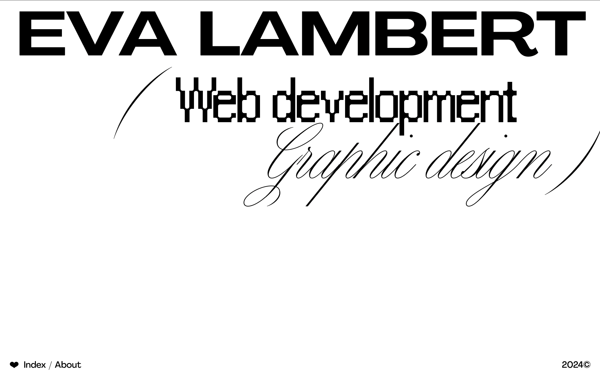
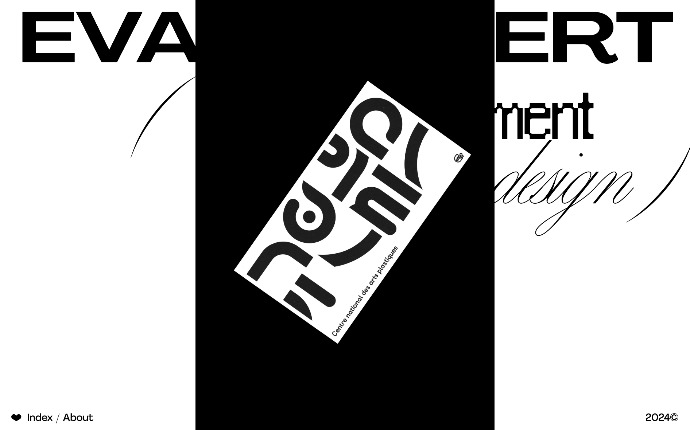
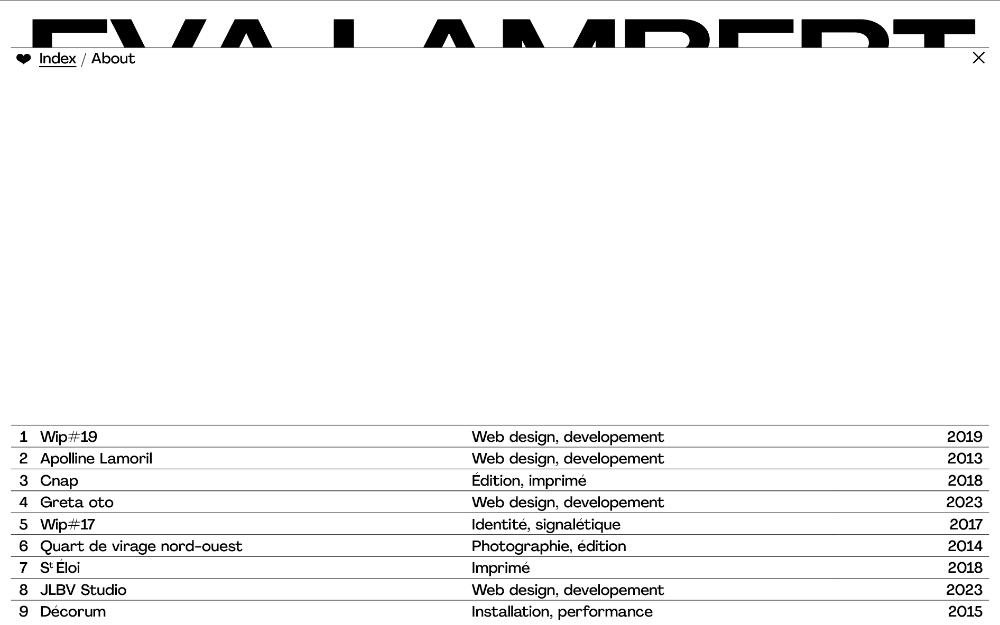
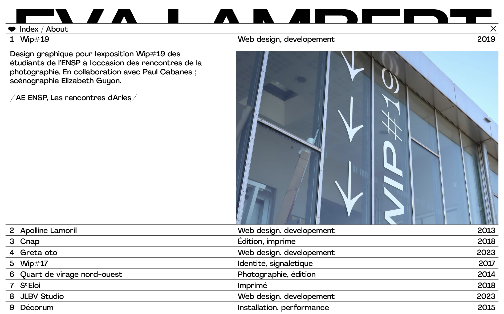
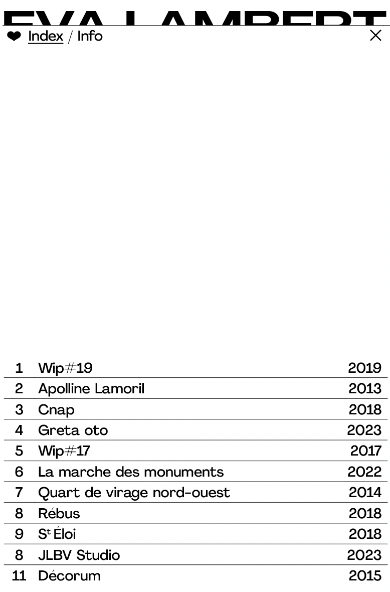

# 🎨 PORTFOLIO

## 🔗 LIEN VERS LE PROJET

[https://evalambert.xyz/](https://evalambert.xyz/)

## 🚧 ÉTAT D'AVANCEMENT

En cours de création 🪵

## 🚀 OBJECTIFS

- Trouver un stage de deux mois en agence 🧃

## 🌐 LANGUAGE UTILISÉ

- Npm
- React.js
- Tailwind
- Swiper
- Framer motion

## 💾 INSTALLATION

```js
npm i
npm run dev
npm run deploy
```

## 👀 MAQUETTE






